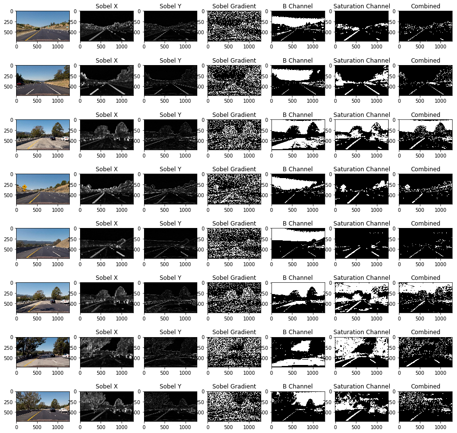

## Writeup Template

### You can use this file as a template for your writeup if you want to submit it as a markdown file, but feel free to use some other method and submit a pdf if you prefer.

---

**Advanced Lane Finding Project**

The goals / steps of this project are the following:

* Compute the camera calibration matrix and distortion coefficients given a set of chessboard images.
* Apply a distortion correction to raw images.
* Use color transforms, gradients, etc., to create a thresholded binary image.
* Apply a perspective transform to rectify binary image ("birds-eye view").
* Detect lane pixels and fit to find the lane boundary.
* Determine the curvature of the lane and vehicle position with respect to center.
* Warp the detected lane boundaries back onto the original image.
* Output visual display of the lane boundaries and numerical estimation of lane curvature and vehicle position.

## [Rubric](https://review.udacity.com/#!/rubrics/571/view) Points

### Here I will consider the rubric points individually and describe how I addressed each point in my implementation.  

---

### Writeup / README

#### 1. Provide a Writeup / README that includes all the rubric points and how you addressed each one.  You can submit your writeup as markdown or pdf.  [Here](https://github.com/udacity/CarND-Advanced-Lane-Lines/blob/master/writeup_template.md) is a template writeup for this project you can use as a guide and a starting point.  

You're reading it!


#### Import Libraries
```python
import os
import cv2
import matplotlib.pyplot as plt
import numpy as np
import seaborn as sns
%matplotlib inline
```

#### Read Chessboard images for Camera calibration
```python
#READ IMAGES FOR CAMERA CALIBRATION
camera_calibration_folder = 'camera_cal'
files = os.listdir(camera_calibration_folder)
cal_cam_img_path = []
cal_cam_img = []
for f in files:
    fpath = os.path.join(camera_calibration_folder, f)
    if(os.path.isfile(fpath)):
        cal_cam_img_path.append(fpath)
        cal_cam_img.append(cv2.imread(fpath))
```

#### See all the Images
```python
def show_allImg(images, col=4):
    rows = len(images)//col
    fig = plt.figure(figsize=(16, 16))
    for i in range(len(images)):
        fig.add_subplot(rows, col, i+1)
        plt.imshow(images[i])

show_allImg(cal_cam_img, col=5)
```


#### Defined Global Variables
```python
#DEFINE GLOBAL VALUES
NX = 9
NY = 6
offset = 100
X_size = cal_cam_img[0].shape[1]
Y_size = cal_cam_img[0].shape[0]
```


```python
#UTILITY FUNCTION To convert Images into different color spaces.
def bgr2rgb(img):
    return cv2.cvtColor(img, cv2.COLOR_BGR2RGB)
def rgb2gray(img):
    return cv2.cvtColor(img, cv2.COLOR_RGB2GRAY)
def bgr2gray(img):
    return cv2.cvtColor(img, cv2.COLOR_BGR2GRAY)
```


### Camera Calibration

#### 1. Briefly state how you computed the camera matrix and distortion coefficients. Provide an example of a distortion corrected calibration image.

I start by preparing "object points", which will be the (x, y, z) coordinates of the chessboard corners in the world. Here I am assuming the chessboard is fixed on the (x, y) plane at z=0, such that the object points are the same for each calibration image.  Thus, `objP` is just a replicated array of coordinates, and `objPoints` will be appended with a copy of it every time I successfully detect all chessboard corners in a test image.  `imgPoints` will be appended with the (x, y) pixel position of each of the corners in the image plane with each successful chessboard detection.  


```python
#UTILITY FUNCTIONS
def finddrawChessBoardCorners(img, nx, ny, isGray=True):
    if(isGray == False):
        gray = bgr2gray(img)
    ret, corners = cv2.findChessboardCorners(gray, (nx, ny), None)
    if(ret == True):
        return cv2.drawChessboardCorners(img, (nx, ny), corners, ret)
    return None
```


```python
#SHOW CHESSBOARD CORNERS
fig = plt.figure(figsize=(16, 16))
img = finddrawChessBoardCorners(cal_cam_img[3], NX, NY, False)
plt.imshow(img)
```


    <matplotlib.image.AxesImage at 0x1ca7c8b4d68>


```python
#EXTRACT IMAGE POINTS AND OBJECT POINTS FOR ALL CHESSBOARD IMAGES
imgPoints = []
objPoints = []
objP = np.zeros((NX*NY, 3), np.float32)
objP[:,:2] = np.mgrid[0:NX,0:NY].T.reshape(-1, 2)

for img in cal_cam_img:
    gray = bgr2gray(img)
    ret, corners = cv2.findChessboardCorners(gray, (NX, NY), None)
    
    if(ret):
        imgPoints.append(corners)
        objPoints.append(objP)

```


I then used the output `objpoints` and `imgpoints` to compute the camera calibration matrix and distortion coefficients using the `cv2.calibrateCamera()` function. 


```python
#CALIBRATE THE CAMERA AND CALCULATE THE MATRIX AND DISTORTION COEFFICIENT OF THE CAMERA
ret, mtx, dist, rvecs, tvecs = cv2.calibrateCamera(objPoints, imgPoints, (X_size, Y_size), None, None)

#UNDISTORT IMAGE FUNCTION
def undist(img):
    return cv2.undistort(img, mtx, dist, None, mtx)
```

I applied this distortion correction to the test image using the `undist()` function defined in the above cell and obtained this result:


```python
fig,axis = plt.subplots(1,2,figsize=(16,16))

axis[0].imshow(cal_cam_img[0])
axis[0].set_title('Original Image')
img = undist(cal_cam_img[0])
axis[1].imshow(img)
axis[1].set_title('Undistorted Image')
plt.tight_layout()
```


#### 1. Provide an example of a distortion-corrected image.

In this step I corrected the distortion for all the test images. The code and result is below:


```python
test_images_folder = 'test_images'
test_images_path = os.listdir(test_images_folder)
test_images = []
test_images_undist = []
fig,axis = plt.subplots(8,2,figsize=(16,16))
j = 1
for i in range(len(test_images_path)):
    path = os.path.join(test_images_folder, test_images_path[i])
    test_images.append(plt.imread(path))
    axis[i,0].imshow(test_images[i])
    axis[i,0].set_title('Original Image')
    img = undist(test_images[i])
    test_images_undist.append(img)
    axis[i,1].imshow(img)
    axis[i,1].set_title('Undistorted Image')
    plt.tight_layout()
```


#### 2. Describe how (and identify where in your code) you used color transforms, gradients or other methods to create a thresholded binary image.  Provide an example of a binary image result.

I used a combination of color and gradient thresholds to generate a binary image (thresholding steps at lines # through # in `another_file.py`).  Here's an example of my output for this step.  (note: this is not actually from one of the test images)


```python
#UTILITY METHODS FOR CALCULATING:

#SOBELX AND SOBELY
def sobel(img, orientation = 'x', kernel_size=3):
    if(orientation == 'x'):
        return np.absolute(cv2.Sobel(img, cv2.CV_64F, 1, 0, ksize = kernel_size))
    else:
        return np.absolute(cv2.Sobel(img, cv2.CV_64F, 0, 1, ksize = kernel_size))

#SOBEL GRADIENT
def mag_sobel(img, kernel_size = 3, thresh=[20,100]):
    sobelx = sobel(img, 'x', kernel_size)
    sobely = sobel(img, 'y', kernel_size)
    mag = np.sqrt(np.square(sobelx) + np.square(sobely))
    binary_output_mag = np.zeros_like(gray)
    scaled_mag = np.uint8(255*mag/np.max(mag))
    binary_output_mag[(scaled_mag>=thresh[0]) & (scaled_mag<=thresh[1])] = 1
    return binary_output_mag

#SOBEL MAGNITUDE
def grad_sobel(img, kernel_size = 7, thresh=[20,120]):
    sobelx = sobel(img, 'x', kernel_size)
    sobely = sobel(img, 'y', kernel_size)
    arct= np.arctan2(sobely, sobelx)
    
    binary_output_arct = np.zeros_like(gray)
    scaled_arct = np.uint8(255*arct/np.max(arct))
    
    binary_output_arct[(scaled_arct>=thresh[0]) & (scaled_arct<=thresh[1])] = 1
    return binary_output_arct
```


```python
grayed_lanes = []
def calibrationMapAll(images, code, channel, kernel_size = 8, thresh = [20,120], isHist = False):
    if(isHist == True):
        fig, axis = plt.subplots(8, 8, figsize=(16,16))
    else:
        fig, axis = plt.subplots(8, 7, figsize=(16,16))
    for ind, img in enumerate(images):
        
        imgHLS = cv2.cvtColor(img, cv2.COLOR_RGB2HLS)
        gray = cv2.cvtColor(img, cv2.COLOR_RGB2GRAY)

        axis[ind, 0].imshow(img)
        kernel = np.ones((5,5),np.uint8)
        
        sobelx = sobel(gray, 'x', kernel_size)
        sobelx = cv2.dilate(sobelx, kernel, iterations = 3)
        sobely = sobel(gray, 'y', kernel_size)
        binary_output_arct = grad_sobel(gray, kernel_size, thresh)
        binary_output_mag = mag_sobel(gray, kernel_size, thresh)
        
        sobelx = cv2.dilate(sobel(gray, 'x', 31), kernel, iterations=3)
        sobelx = cv2.morphologyEx(sobelx, cv2.MORPH_CLOSE, kernel)
        axis[ind, 1].imshow(sobelx, cmap='gray')
        axis[ind, 1].set_title('Sobel X')
        
        axis[ind, 2].imshow(sobely, cmap='gray')
        axis[ind, 2].set_title('Sobel Y')
        
        axis[ind, 3].imshow(binary_output_arct, cmap='gray')
        axis[ind, 3].set_title('Sobel Gradient')
        
        lower_blue = np.array([150])
        upper_blue = np.array([255])
        bChannel = img[:,:,1]
        bChannel = cv2.inRange(bChannel, lower_blue, upper_blue)
        axis[ind, 4].imshow(bChannel, cmap='gray')
        axis[ind, 4].set_title('B Channel')
        
        lower_Saturation = np.array([0,0,120])
        upper_Saturation = np.array([255, 255, 255])
        saturation = cv2.dilate(cv2.inRange(imgHLS, lower_Saturation, upper_Saturation), kernel, iterations=3)
        axis[ind, 5].imshow(saturation, cmap='gray')
        axis[ind, 5].set_title('Saturation Channel')
        
        combined = np.zeros_like(binary_output_mag)
        combined[(sobelx == 1) | ((binary_output_arct == 1) & (binary_output_mag == 1)) | (((saturation > 10) & (bChannel > 10)))] = 255
        axis[ind, 6].imshow(combined, cmap='gray')
        axis[ind, 6].set_title('Combined')
        grayed_lanes.append(combined)
    
        if(isHist == True):
            histogram = np.sum(combined[combined.shape[0]//2:,:], axis=0)
            axis[ind, 7].plot(histogram)
            axis[ind, 7].set_title('Histogram')
            half_width = np.int(histogram.shape[0]/2)
            plt.tight_layout()
        
calibrationMapAll(test_images_undist, cv2.COLOR_RGB2HLS, 2, kernel_size = 31, thresh = [30, 150])
```





#### 3. Describe how (and identify where in your code) you performed a perspective transform and provide an example of a transformed image.

The code for my perspective transform includes a function called `warper()`, which appears in lines 1 through 8 in the file `example.py` (output_images/examples/example.py) (or, for example, in the 3rd code cell of the IPython notebook).  The `warper()` function takes as inputs an image (`img`), as well as source (`src`) and destination (`dst`) points.  I chose the hardcode the source and destination points in the following manner:

```python
src = np.array([[150,720],[590, 450],[700, 450], [1250, 720]], np.float32)

dst = np.array([[200 ,720], [200  ,0], [980 ,0], [980 ,720]], np.float32)
```

This resulted in the following source and destination points:

| Source points       | Destination Points   | 
|:-------------:|:-------------:| 
| 150, 720      | 200, 720        | 
| 590, 450      | 200, 0      |
| 700, 450     | 980, 0      |
| 1250, 720      | 980, 720        |


```python
#VISUALIZE THE REGION OF INTEREST
ROI_PTS = np.array([[150,720],[590, 450],[700, 450], [1250, 720]], np.int32)
ROI_PTS = ROI_PTS.reshape((-1,1,2))
j = 1
fig = plt.figure(figsize = (16,16))
for img in test_images_undist:
    roi_img = np.copy(img)
    fig.add_subplot(4, 4, j)
    plt.imshow(img)
    plt.title('Original Image')
    j+=1
    fig.add_subplot(4, 4, j)
    poly_undist = cv2.polylines(roi_img, [ROI_PTS], True,(255,0,0),5)
    plt.imshow(poly_undist)
    plt.title('Region of Interest')
    j+=1
    plt.tight_layout()
```


#### I verified that my perspective transform was working as expected by drawing the `src` and `dst` points onto a test image and its warped counterpart to verify that the lines appear parallel in the warped image.


```python
#WARP TEST IMAGES  
src = np.array([[150,720],[590, 450],[700, 450], [1250, 720]], np.float32)
src = src.reshape((-1,1,2))
dst = np.array([[200 ,720], [200  ,0], [980 ,0], [980 ,720]], np.float32)
dst = dst.reshape((-1,1,2))
M = cv2.getPerspectiveTransform(src, dst)
M_inv = cv2.getPerspectiveTransform(dst, src)
j = 1
fig = plt.figure(figsize = (16,16))
test_images_warped = []
for img in test_images_undist:
    roi_img = np.copy(img)
    
    fig.add_subplot(4, 4, j)
    plt.imshow(img)
    plt.title('Original Image')
    j+=1
    fig.add_subplot(4, 4, j)
    warped = cv2.warpPerspective(img, M, (X_size, Y_size), flags=cv2.INTER_LINEAR)
    test_images_warped.append(warped)
    plt.imshow(warped)
    plt.title('Warped Image')
    j+=1
    plt.tight_layout()

```


#### Applying the color channels on the Warped Lane lines
As we can see from the below results that Sobel is doing a pretty good job in detecting most of the lines followd by Saturation but saturation is having noise in many of the frames as seen below. We can do AND for saturation and B channel from RGB as this removes major part of the noise and detects lanes. We are also calculating AND of sobel direction and Sobel Magnitude. 


```python
calibrationMapAll(test_images_warped, cv2.COLOR_RGB2HLS, 2, kernel_size = 31, thresh = [30, 150], isHist = True)
```


So in the final combined image we are using X_sobel OR (Sobel_Magnitude & Sobel_Gradient) OR (R & S). We are also dilating the Saturation Channel and Sobel X for getting more part of lane for more confident score. Also we are applying erosion on the combined image as this will remove the small noise near the lanes. The final code for taking a warped lane image and returning the output is in below cell.


```python
def getLanes(img, code = cv2.COLOR_RGB2HLS, channel=2, kernel_size = 31, thresh = [30,150]):
    
    imgHls = cv2.cvtColor(img, cv2.COLOR_RGB2HLS)
    gray = cv2.cvtColor(img, cv2.COLOR_RGB2GRAY)

    kernel = np.ones((5,5),np.uint8)

    binary_output_arct = grad_sobel(gray, kernel_size, thresh)
    binary_output_mag = mag_sobel(gray, kernel_size, thresh)

    lower_blue = np.array([120])
    upper_blue = np.array([255])
    blue = img[:,:,1]
    blue = cv2.inRange(blue, lower_blue, upper_blue)

    lower_Saturation = np.array([0,0,120])
    upper_Saturation = np.array([255, 255, 255])
    saturation = cv2.dilate(cv2.inRange(imgHls, lower_Saturation, upper_Saturation), kernel, iterations=3)

    sobelx = cv2.dilate(sobel(gray, 'x', 31), kernel, iterations=3)
    sobelx = cv2.morphologyEx(sobelx, cv2.MORPH_CLOSE, kernel)

    combined = np.zeros_like(binary_output_mag)
    combined[(sobelx == 1) | ((binary_output_arct == 1) & (binary_output_mag == 1)) | (((saturation > 10) & (blue > 10)))] = 255
    return cv2.erode(combined, kernel)

plt.imshow(getLanes(test_images_warped[0]), cmap='gray')
plt.title('Binary Image of warp Image')
```


    <matplotlib.text.Text at 0x1ca07081dd8>


## 4. Describe how (and identify where in your code) you identified lane-line pixels and fit their positions with a polynomial?

I used a 2nd order polynomial on the binary images to detected Lanes and the minimum pixels count for detecting an image is 50. Also this function will return the visual result of applying sliding window on binary detected lanes. Code for the same is in below cells.


```python
def firstFrame(binary_warped):
    histogram = np.sum(binary_warped[binary_warped.shape[0]//2:,:], axis=0)
    
    out_img = np.dstack((binary_warped, binary_warped, binary_warped))*255
    
    midpoint = np.int(histogram.shape[0]/2)
    leftx_base = np.argmax(histogram[:midpoint])
    rightx_base = np.argmax(histogram[midpoint:]) + midpoint

    nwindows = 9
    window_height = np.int(binary_warped.shape[0]/nwindows)
    nonzero = binary_warped.nonzero()
    nonzeroy = np.array(nonzero[0])
    nonzerox = np.array(nonzero[1])
    
    leftx_current = leftx_base
    rightx_current = rightx_base
    
    margin = 100
    minpix = 50
    
    left_lane_inds = []
    right_lane_inds = []

    for window in range(nwindows):
        win_y_low = binary_warped.shape[0] - (window+1)*window_height
        win_y_high = binary_warped.shape[0] - window*window_height
        win_xleft_low = leftx_current - margin
        win_xleft_high = leftx_current + margin
        win_xright_low = rightx_current - margin
        win_xright_high = rightx_current + margin
        cv2.rectangle(out_img,(win_xleft_low,win_y_low),(win_xleft_high,win_y_high),(0,255,0), 2) 
        cv2.rectangle(out_img,(win_xright_low,win_y_low),(win_xright_high,win_y_high),(0,255,0), 2) 
        good_left_inds = ((nonzeroy >= win_y_low) & (nonzeroy < win_y_high) & 
        (nonzerox >= win_xleft_low) &  (nonzerox < win_xleft_high)).nonzero()[0]
        good_right_inds = ((nonzeroy >= win_y_low) & (nonzeroy < win_y_high) & 
        (nonzerox >= win_xright_low) &  (nonzerox < win_xright_high)).nonzero()[0]
        left_lane_inds.append(good_left_inds)
        right_lane_inds.append(good_right_inds)
        if len(good_left_inds) > minpix:
            leftx_current = np.int(np.mean(nonzerox[good_left_inds]))
        if len(good_right_inds) > minpix:        
            rightx_current = np.int(np.mean(nonzerox[good_right_inds]))

    left_lane_inds = np.concatenate(left_lane_inds)
    right_lane_inds = np.concatenate(right_lane_inds)

    leftx = nonzerox[left_lane_inds]
    lefty = nonzeroy[left_lane_inds] 
    rightx = nonzerox[right_lane_inds]
    righty = nonzeroy[right_lane_inds] 
    
    out_img[nonzeroy[left_lane_inds], nonzerox[left_lane_inds]] = [255, 0, 0]
    out_img[nonzeroy[right_lane_inds], nonzerox[right_lane_inds]] = [0, 0, 255]

    left_fit = np.polyfit(lefty, leftx, 2)
    right_fit = np.polyfit(righty, rightx, 2)
    return left_fit, right_fit, out_img

def secondFrame(binary_warped, left_fit, right_fit):
    nonzero = binary_warped.nonzero()
    nonzeroy = np.array(nonzero[0])
    nonzerox = np.array(nonzero[1])
    margin = 100
    left_lane_inds = ((nonzerox > (left_fit[0]*(nonzeroy**2) + left_fit[1]*nonzeroy + 
    left_fit[2] - margin)) & (nonzerox < (left_fit[0]*(nonzeroy**2) + 
    left_fit[1]*nonzeroy + left_fit[2] + margin))) 

    right_lane_inds = ((nonzerox > (right_fit[0]*(nonzeroy**2) + right_fit[1]*nonzeroy + 
    right_fit[2] - margin)) & (nonzerox < (right_fit[0]*(nonzeroy**2) + 
    right_fit[1]*nonzeroy + right_fit[2] + margin)))  

    leftx = nonzerox[left_lane_inds]
    lefty = nonzeroy[left_lane_inds] 
    rightx = nonzerox[right_lane_inds]
    righty = nonzeroy[right_lane_inds]
    left_fit = np.polyfit(lefty, leftx, 2)
    right_fit = np.polyfit(righty, rightx, 2)
    ploty = np.linspace(0, binary_warped.shape[0]-1, binary_warped.shape[0] )
    left_fitx = left_fit[0]*ploty**2 + left_fit[1]*ploty + left_fit[2]
    right_fitx = right_fit[0]*ploty**2 + right_fit[1]*ploty + right_fit[2]
    return ploty, left_fitx, right_fitx, left_lane_inds, right_lane_inds

# GET THE HIGHLIGHTED LINES
def curvesHighlight(binary_warped, left_lane_inds, right_lane_inds, left_fitx, right_fitx, ploty):
    margin = 100
    nonzero = binary_warped.nonzero()
    nonzeroy = np.array(nonzero[0])
    nonzerox = np.array(nonzero[1])
    # Create an image to draw on and an image to show the selection window
    out_img = np.dstack((binary_warped, binary_warped, binary_warped))*255
    window_img = np.zeros_like(out_img)
    # Color in left and right line pixels
    out_img[nonzeroy[left_lane_inds], nonzerox[left_lane_inds]] = [255, 0, 0]
    out_img[nonzeroy[right_lane_inds], nonzerox[right_lane_inds]] = [0, 0, 255]

    # Generate a polygon to illustrate the search window area
    # And recast the x and y points into usable format for cv2.fillPoly()
    left_line_window1 = np.array([np.transpose(np.vstack([left_fitx-margin, ploty]))])
    left_line_window2 = np.array([np.flipud(np.transpose(np.vstack([left_fitx+margin, 
                                  ploty])))])
    left_line_pts = np.hstack((left_line_window1, left_line_window2))
    right_line_window1 = np.array([np.transpose(np.vstack([right_fitx-margin, ploty]))])
    right_line_window2 = np.array([np.flipud(np.transpose(np.vstack([right_fitx+margin, 
                                  ploty])))])
    right_line_pts = np.hstack((right_line_window1, right_line_window2))

    # Draw the lane onto the warped blank image
    cv2.fillPoly(window_img, np.int_([left_line_pts]), (0,255, 0))
    cv2.fillPoly(window_img, np.int_([right_line_pts]), (0,255, 0))
    result = cv2.addWeighted(out_img, 1, window_img, 0.3, 0)
    
    return result

```

#### 5. Describe how (and identify where in your code) you calculated the radius of curvature of the lane and the position of the vehicle with respect to center.

I did this in below blocks by taking the left and right lines and then calculating the radius. For calculating the position I am getting the last points of the left and right line and then getting the center of the lane and by taking the difference of this with the center of the Image we are able to get the position of the image.


```python
def getAvgRadius(ploty, left_fitx, right_fitx):
    ym_per_pix = 30/720 # meters per pixel in y dimension
    xm_per_pix = 3.7/700 # meters per pixel in x dimension
    y_eval = np.max(ploty)
    
    # Fit new polynomials to x,y in world space
    left_fit_cr = np.polyfit(ploty*ym_per_pix, left_fitx*xm_per_pix, 2)
    right_fit_cr = np.polyfit(ploty*ym_per_pix, right_fitx*xm_per_pix, 2)
    # Calculate the radius of curvature using 2nd degree polynomial
    left_curverad = ((1 + (2*left_fit_cr[0]*y_eval*ym_per_pix + left_fit_cr[1])**2)**1.5) / np.absolute(2*left_fit_cr[0])
    right_curverad = ((1 + (2*right_fit_cr[0]*y_eval*ym_per_pix + right_fit_cr[1])**2)**1.5) / np.absolute(2*right_fit_cr[0])
    # Now our radius of curvature is in meters
    avg_curve = np.mean([left_curverad, right_curverad])
    
    # Calculate the car position
    position = (left_fitx[-1:] + right_fitx[-1:])/2
    position = abs(X_size/2 - position)*xm_per_pix
    
    return avg_curve, float(position)
```

##### Draw the lane and radius, position text on the image.
Function to generate Polyfill from binary image, unwarp it and then plot it on the Original image along with Radius and Offset from center. Then in next cell we will pass the image and will get the resultant Image.


```python
def unwarpedLanes(img, binary_output, l_fit, r_fit):
    #print(l_fit, r_fit)
    
    plot_y, l_fit_s, r_fit_s, left_lane_inds, right_lane_inds = secondFrame(binary_output, l_fit, r_fit)
    avg_curve, carPosition = getAvgRadius(plot_y, l_fit_s, r_fit_s)
    curveHighlight = curvesHighlight(binary_output, left_lane_inds, right_lane_inds, l_fit_s, r_fit_s, plot_y)
    
    warp_zero = np.zeros_like(binary_output).astype(np.uint8)
    color_warp = np.dstack((warp_zero, warp_zero, warp_zero))
    
    # Recast the x and y points into usable format for cv2.fillPoly()
    pts_left = np.array([np.transpose(np.vstack([l_fit_s, plot_y]))])
    pts_right = np.array([np.flipud(np.transpose(np.vstack([r_fit_s, plot_y])))])
    pts = np.hstack((pts_left, pts_right))

    # Draw the lane onto the warped blank image
    cv2.fillPoly(color_warp, np.int_([pts]), (0,255, 0))
    
    # Warp the blank back to original image space using inverse perspective matrix (Minv)
    newwarp = cv2.warpPerspective(color_warp, M_inv, (X_size, Y_size) )
    # Combine the result with the original image
    result = cv2.addWeighted(img, 1, newwarp, 0.3, 0)
    
    fontFace = 2
    text = "Radius of Curvature of the Lane: {:.0f} m".format(avg_curve)
    cv2.putText(result, text, (50,50),fontFace, 1, (255,255,255), 2)
    text = "Vehicle Position: Offset from Center with {:.2f} m".format(carPosition)
    cv2.putText(result, text, (50,100), fontFace, 1, (255,255,255), 2)
    
    return result, curveHighlight, plot_y,l_fit_s, r_fit_s
```

##### Image Pipeline
Function for Image pipepline. Will return result of the operations on a single Image along with Sliging window visualization.


```python
def returnHighlightedLane(img):
    global l_fit
    global r_fit
#     fig, axis = plt.subplots(1,2,figsize=(16,16))
    undistorted_img = undist(img)
    warped = cv2.warpPerspective(undistorted_img, M, (X_size, Y_size), flags=cv2.INTER_LINEAR)

    binary_output = getLanes(warped)
    
    l_fit, r_fit, out_img = firstFrame(binary_output)
    result, curve_highlight, ploty,l_fit_s, r_fit_s = unwarpedLanes(img, binary_output, l_fit, r_fit)
    
    resized_boxes = cv2.resize(curve_highlight,( int(X_size/8), int(Y_size/8)), interpolation = cv2.INTER_CUBIC)
    resized_warp = cv2.resize(warped,( int(X_size/8), int(Y_size/8)), interpolation = cv2.INTER_CUBIC)
    resized_binary = cv2.resize(binary_output,( int(X_size/8), int(Y_size/8)), interpolation = cv2.INTER_CUBIC)
    
    return result, out_img, ploty, l_fit_s, r_fit_s, curve_highlight
    
result, out_img, ploty, l_fit_s, r_fit_s, curve_highlight = returnHighlightedLane(test_images[7])
fig, axis = plt.subplots(1,2,figsize=(20,20))
axis[0].imshow(out_img)
axis[0].plot(l_fit_s, ploty,'y')
axis[0].plot(r_fit_s, ploty,'y')
axis[1].imshow(curve_highlight)
axis[1].plot(l_fit_s, ploty,'y')
axis[1].plot(r_fit_s, ploty,'y')

```


    [<matplotlib.lines.Line2D at 0x1ca0dd96ac8>]


### 6. Provide an example image of your result plotted back down onto the road such that the lane area is identified clearly.

I implemented this in `returnHighlightedLane()` function (cell above) and the result is in below cells.


```python
fig= plt.figure(figsize=(20,20))
plt.imshow(result)
```


    <matplotlib.image.AxesImage at 0x1ca0de150f0>


---
### Pipeline (video)

#### 1. Provide a link to your final video output.  Your pipeline should perform reasonably well on the entire project video (wobbly lines are ok but no catastrophic failures that would cause the car to drive off the road!).

Here's a [link to my video result](./output.mp4)


```python
plt.figure(figsize=(16,16))
l_fit = None
r_fit = None
def pipeline(img):
    global l_fit
    global r_fit
    undistorted_img = undist(img)
    warped = cv2.warpPerspective(undistorted_img, M, (X_size, Y_size), flags=cv2.INTER_LINEAR)

    binary_output = getLanes(warped)

    l_fit, r_fit, out_img = firstFrame(binary_output)
    result, curve_highlight, ploty,l_fit_s, r_fit_s = unwarpedLanes(img, binary_output, l_fit, r_fit)
    
    curve_highlight = cv2.resize(curve_highlight,( int(X_size/8), int(Y_size/8)), interpolation = cv2.INTER_CUBIC)
    resized_warp = cv2.resize(warped,( int(X_size/8), int(Y_size/8)), interpolation = cv2.INTER_CUBIC)
    resized_binary = cv2.resize(binary_output,( int(X_size/8), int(Y_size/8)), interpolation = cv2.INTER_CUBIC)
    
    result[150:150+resized_warp.shape[0],100:100+resized_warp.shape[1]] = resized_warp
    result[150:150+resized_warp.shape[0],300:300+resized_warp.shape[1]] = np.dstack([resized_binary,resized_binary,resized_binary])
    result[150:150+resized_warp.shape[0],500:500+resized_warp.shape[1]] = curve_highlight
    return result
```


    <matplotlib.figure.Figure at 0x1ca0de42278>


```python
import moviepy
from moviepy.editor import VideoFileClip
video_output1 = 'output.mp4'
video_input1 = VideoFileClip('project_video.mp4')#.subclip(38, 41)
processed_video = video_input1.fl_image(pipeline)
%time processed_video.write_videofile(video_output1, audio=False)
video_input1.reader.close()
video_input1.audio.reader.close_proc()
```

    [MoviePy] >>>> Building video project_video_output11.mp4
    [MoviePy] Writing video project_video_output11.mp4
    

    100%|█████████████████████████████████████████████████████████████████████████████▉| 1260/1261 [09:58<00:00,  2.13it/s]
    

    [MoviePy] Done.
    [MoviePy] >>>> Video ready: project_video_output11.mp4 
    
    Wall time: 10min
    

---

### Discussion

#### 1. Briefly discuss any problems / issues you faced in your implementation of this project.  Where will your pipeline likely fail?  What could you do to make it more robust?

The first challenge in the process was to find the source and destination points. After several hit and trial I was able to find the good points for warp. Then finging lanes from the image was a challenge as the channels I was using were not able to detect the white lanes in shadows and concrete patches, to resolve this I used Sobel X with dilate operation so that lane lines become more intense and then eroded the combined image so that noise from the final binary image can be resolved.

Lanes are a bit fluctuating on the concrete patches. To make the pipeline more robust, we can average the lines for several frames.
